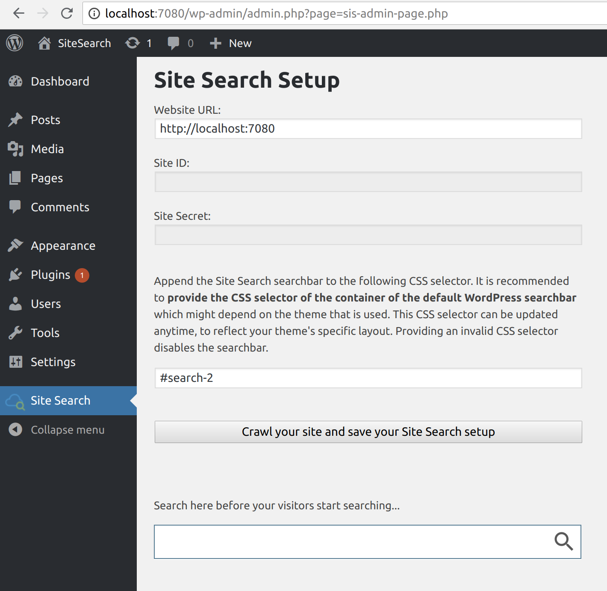

[/statusIcon)](https://ci.sitesearch.cloud/viewType.html?buildTypeId=IntraFind_Oss_Build)

Seamless Site Search WordPress Integration
=
You have an existing WordPress site or blog and want to replace its default search with Site Search? There is a Site Search WordPress plugin available that makes Site Search integration in WordPress just a matter of a few clicks. This gives non-technical business users the flexibility to integrate Site Search into your site without any technical know-how. Absolutely no PHP code modification is required, to integrate Site Search into your site. Currently WordPress is the only the CMS where we offer the most seamless integration available, basically a plugin-driven one-click setup. Soon we may provide plugin-driven integration for Typo3, Joomla, and other CMS. However you can also integrate Site Search into these CMS already today without a plugin, using plain HTML. 

# About

* [API](https://api.sitesearch.cloud/swagger-ui.html)
* [Documentation](https://github.com/intrafind/if-sitesearch/blob/master/docs/faq.md)
    
***> > > [Try out!](https://sitesearch.cloud/integration-with-wordpress/) < < <***

# How to

Just follow the steps below to integrate Site Search into your WordPress CMS.

1. Download the Site Search WordPress plugin and install it in WordPress’ Plugins section  
   

2. Activate the freshly installed Site Search plugin  
  

3. Navigate to the Site Search configuration section, adjust the URL that should be crawled, and click on the “crawl” button.  
  

4. Try out the search results that your visitors will see when they use your search  
  

5. Let your users enjoy great search results  
  
